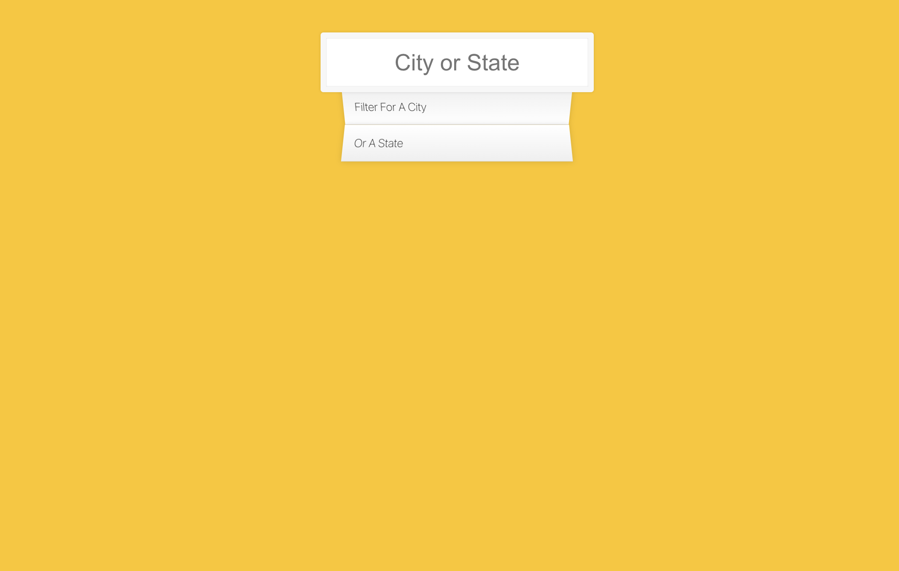

# 愛伯達前端面試

- **目標** 根據 `Spec` 改寫成最好的解決方案，我使用ReactJS來改寫。

---

## Project Preview

---

## Spec

1. 數據整合：
    - 使用 Ajax 來獲取數據，可以視情況選擇使用的工具。
    - 處理非同步數據載入及錯誤狀況。
2. 搜尋功能：
    - 實作一個搜尋輸入框。
    - 根據輸入即時過濾結果。
3. 顯示結果：
    - 展示與輸入匹配的結果。
    - 考量空白和無匹配結果時的使用者體驗。
4. 使用者介面：
    - 有需要可以利用所選框架的元件和樣式系統。
    - 確保介面美觀、響應式及易於使用。
5. 程式碼組織：
    - 清晰的元件劃分與邏輯封裝。
    - 遵循框架推薦的最佳實踐和程式碼風格。

## 評估標準
- 功能的完整性與正確性。
- 程式碼品質與組織性。
- 使用者介面設計與體驗。
- 對框架特性和最佳實踐的理解與運用。
---

## demo Website 

[github page](https://rubytzu.github.io/RaidSonic-form/)
